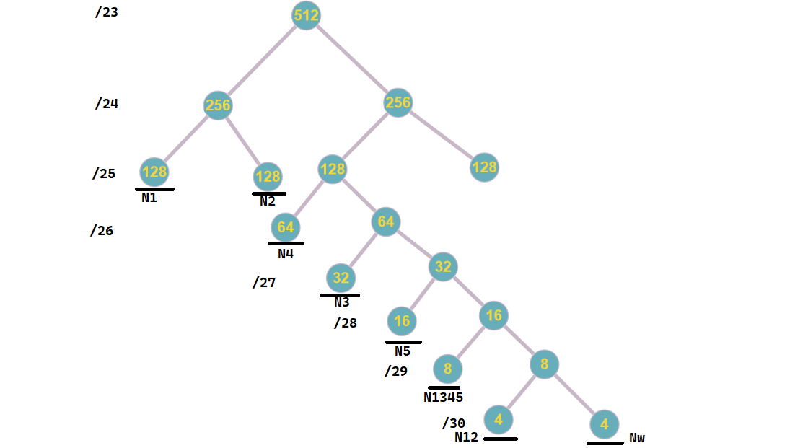

# Computer Networks project

### Network IP: 103.190.44.0  
### Network mask: 225.225.254.0(/23)

---

### Sub networks:
> N1: 120 IP's  
> N2: 72 IP's  
> N3: 24 IP's  
> N4: 32 IP's  
> N5: 8 IP's  

There are 3 extra networks(do not need a router) we need to care care of  
> N12: 2 IP  
> N1345: 4 IP's  
> Nw: 2 IP's  

---

### 

---

We know that x represents the number of zeros of the NM ==> x = 9  
The number of available IP addresses is $2^{9} = 512$.

For each subnetwork we need n IP addresses + 1 IP address for the router + BA + NA.
So, the formula to obtain the number of IP adresses for networks with a router is: $no. \ IP's = n \ + \ 3$.

For networks without router(extra networks): $no. \ IP's = n \ + \ 2$.

---

### Number of IP addresses required:

> N1: 120 + <cg>3</cg> = 123 IP's \<= **128** = $2^7$ &nbsp;&nbsp;&nbsp; &nbsp;&nbsp;**/25**  
> N2: 72 + <cg>3</cg> = 75 IP's  \<= **128** = $2^7$ &nbsp; &nbsp; &nbsp; &nbsp; &nbsp; **/25**  
> N3: 24 + <cg>3</cg> = 27 IP's  \<= **32** = $2^5$ &nbsp; &nbsp; &nbsp; &nbsp; &nbsp; &nbsp; **/27**  
> N4: 32 + <cg>3</cg> = 35 IP's  \<= **64** = $2^6$ &nbsp; &nbsp; &nbsp; &nbsp; &nbsp; &nbsp; **/26**  
> N5: 8 + <cg>3</cg> = 11 IP's  \<= **16** = $2^4$ &nbsp; &nbsp; &nbsp; &nbsp; &nbsp; &nbsp; &nbsp; **/28**  
> N12: 2 + <cr>2</cr> = 4 IP's  \<= **4** = $2^2$ &nbsp; &nbsp; &nbsp; &nbsp; &nbsp; &nbsp; &nbsp; &nbsp; **/30**  
> N1345: 4 + <cr>2</cr> = 6 IP's \<= **8** = $2^3$ &nbsp; &nbsp; &nbsp; &nbsp; &nbsp; &nbsp; **/29**  
> Nw: 2 + <cr>2</cr> = 4 IP's \<= **4** = $2^2$ &nbsp;&nbsp; &nbsp; &nbsp; &nbsp; &nbsp; &nbsp; &nbsp; &nbsp; **/30**

So in total we need 384 IP addresses \< 512 IP's that we have available.

---

### Recursive network split using a binary tree:

> N1 = 128  
> N2 = 128  
> N4 = 64  
> N3 = 32  
> N5 = 16  
> N1345 = 8  
> N12 = 4  
> Nw = 4  

---

### Recursive network split using intervals:

103.190.44.0  /23

NA: 103.190.44.0 (obtained by doing AND between IP and NM)  
BA: 103.190.45.255 (obtained by doind OR between IP and not NM)  

$[0..............................................................................................................................................................................512]$
$
[0..................................................................................255][256...............................................................................512]$
$
[0....................................127][128.................................255][256..................................383][384.................................512]$
$
[0....................................127][128.................................255][256...........319][320..........383][384.................................512]$
$
[0....................................127][128................................255][256...........319][320..351][352..383][384............................512]$
$
[0..................................127][128...............................255][256...........319][320..335][336..351][352..367][368..383][384..512]$
$
[0...............127][128...............255][256................319][320..335][336..351][352..359][360..367][368..375][376..383][384..512]$
$
[0..........127][128............255][256..........319][320..335][336..351][352..359][360..367][368..375][376..379][380..383][384..512]$

---

### Enumerating the networks:

> N1 = 103.190.44.0 /25 (.128)  (R1 = .1, S1 = .2)  
> N2 = 103.190.44.128 /25 (.128) (R2 = .129, S2web = .130)  
> N4 = 103.190.45.0 /26  (.192) (R4 = .1)  
> N3 = 103.190.45.64 /27 (.224) (R3 = .65, S3dns = .66)  
> N5 = 103.190.45.96 /28  (.240) (R5 = .97)  
> N1345 = 103.190.45.112 /29  (.248) (R1 = 113, R3 = 114, R4 = 115, R5 = 116)  
> N12 = 103.190.45.120 /30  (.252) (R1 = 121, R2 = 122)  
> Nw = 103.190.45.124 /30 (.252) (R1 = 125, Rw = 126)  

---

